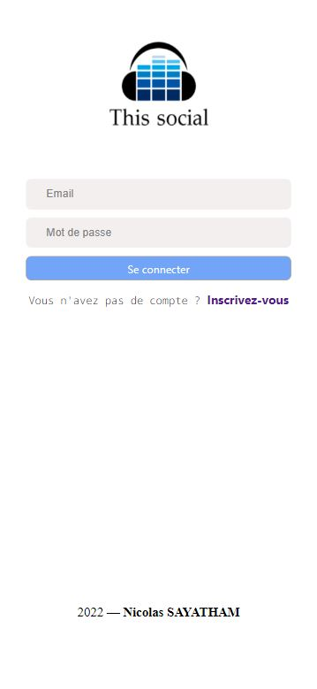
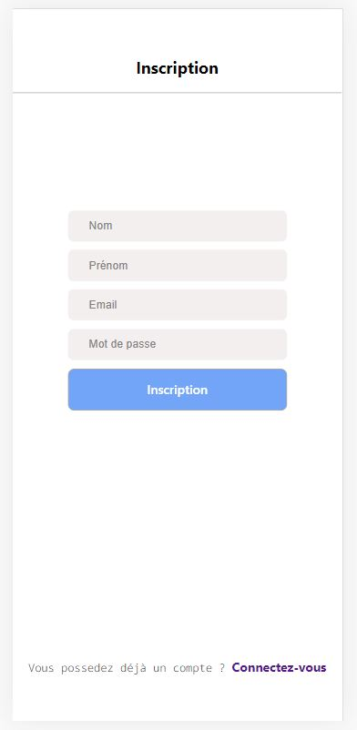
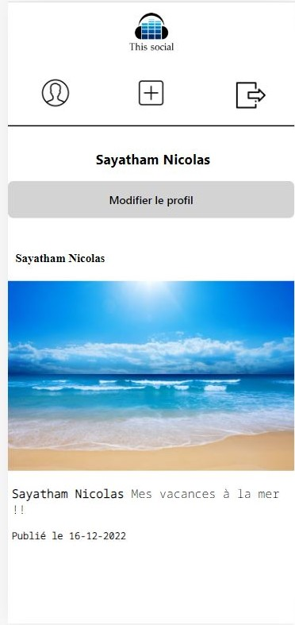
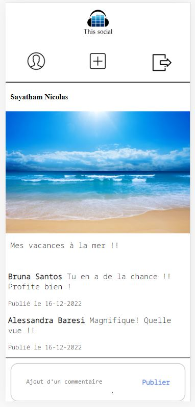
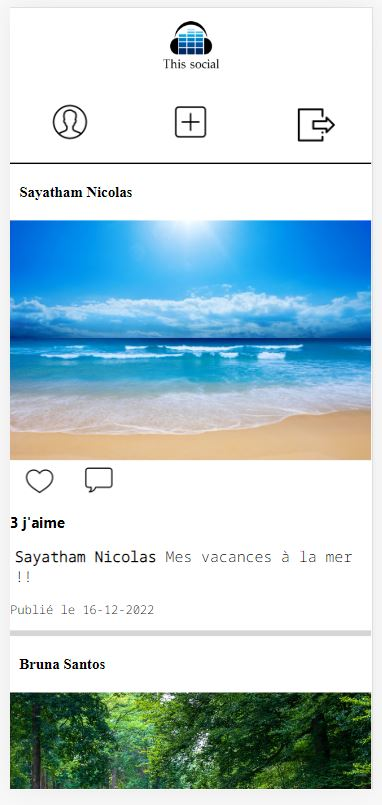

# social

## Création d'un réseau social 

- Ajout d'un utilisateur / Modification du profil
- Ajout de publication / commentaire / like
- Utilisation des requêtes api fetch
- Traitement des informations en base de donnée

Framework : VueJS








## Project setup
```
npm install
```

### Compiles and hot-reloads for development
```
npm run serve
```

### Compiles and minifies for production
```
npm run build
```

